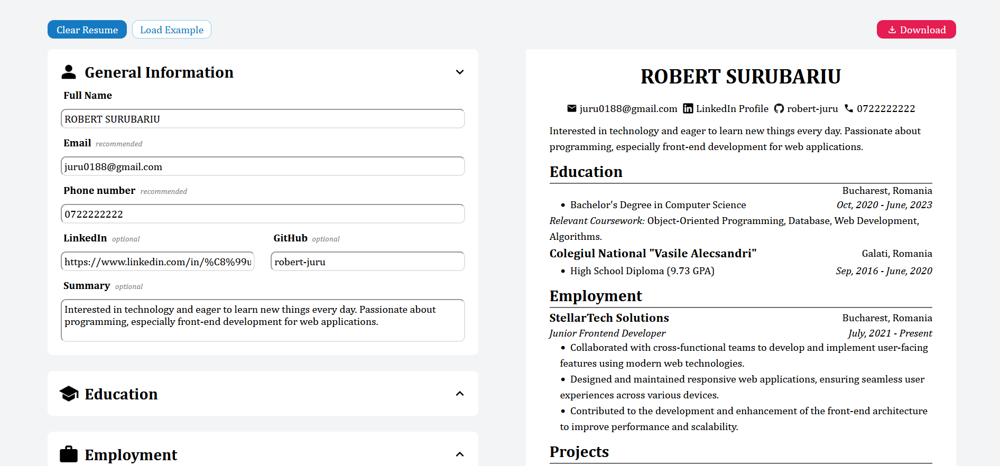

# cv-maker

This CV Maker app is a React-based tool designed to simplify the creation of professional resumes. With an intuitive user interface and modular structure, users can easily input their details and instantly generate a well-organized CV.

### Features

- User-Friendly Interface: Intuitive and easy-to-use interface for creating personalized resumes.
- Customizable Sections: Sections for General Information, Education, Employment, Projects and Skills to build a comprehensive resume.
- Live Preview: Real-time preview of the CV as you fill in details.
- Downloadable CV: Option to download the created CV in PDF format.

### Live: https://cv-maker-robert-juru.vercel.app/

